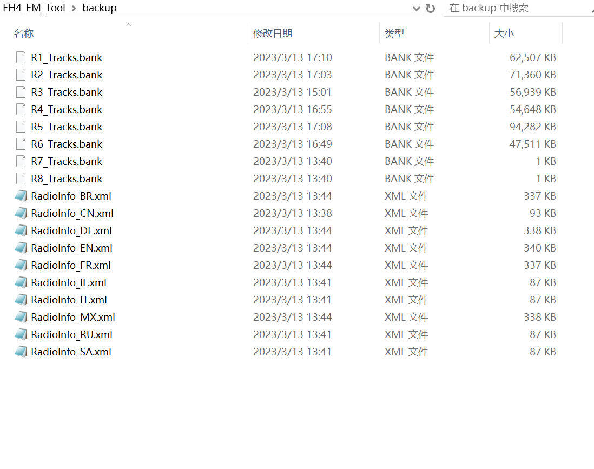
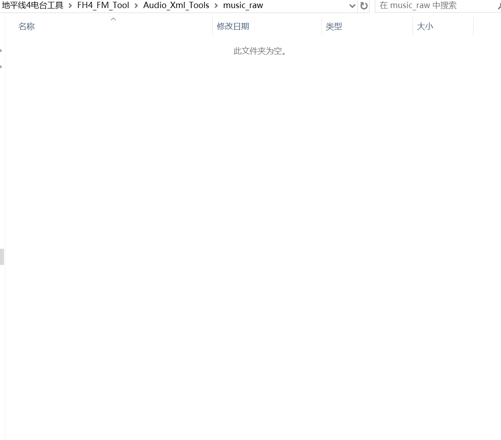
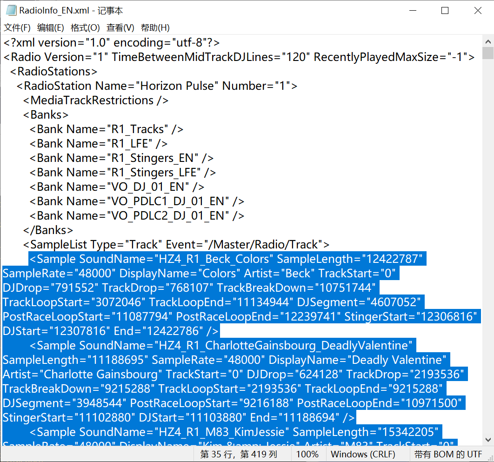
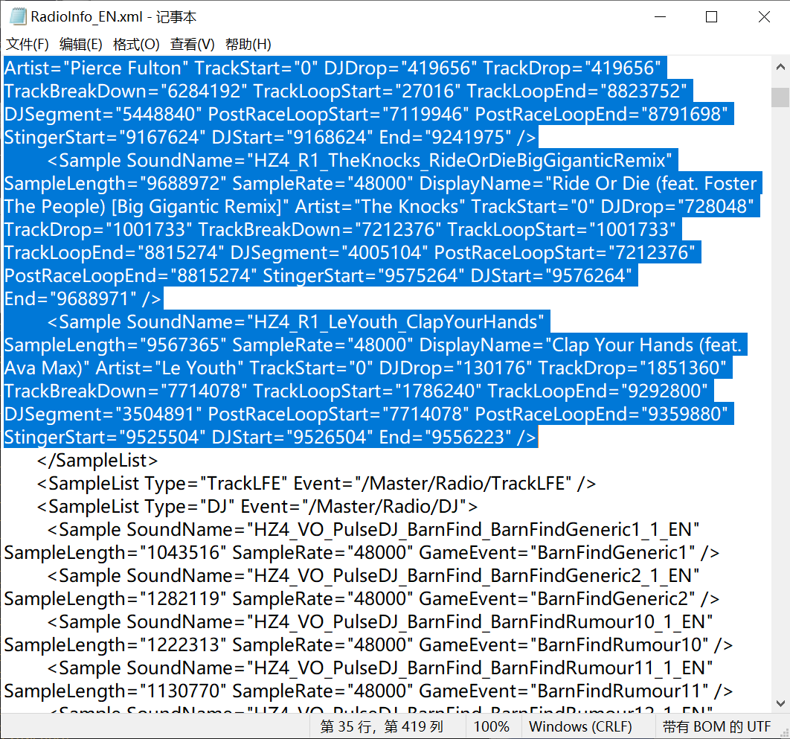
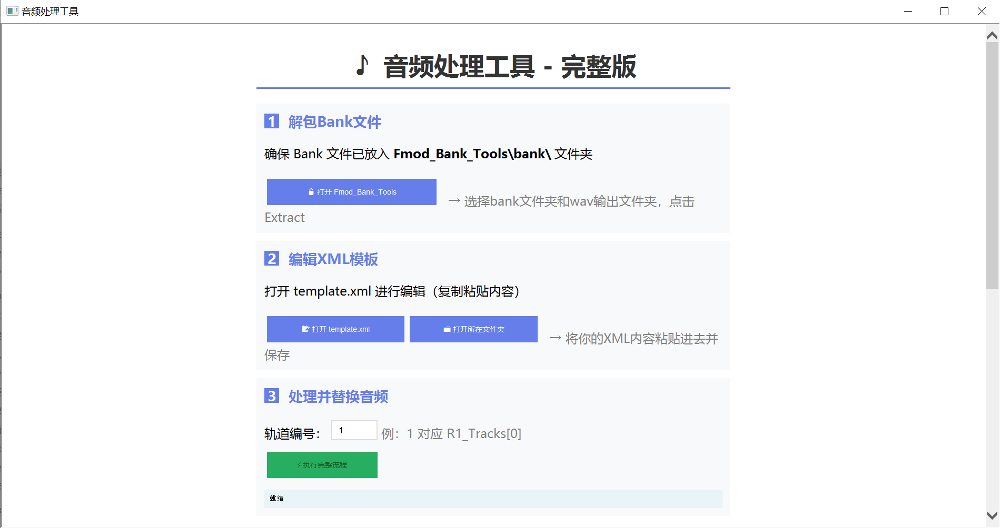

# FH4 FM Tool


地平线 4 自定义电台替换工具。

**实现：** 把地平线 4(Froze Horizon 4) 游戏内任意一个电台的歌曲，替换成你自己准备的音乐，并让游戏正确识别歌名、作者(英文歌曲自带相关元数据时)，以及提供简易版的 DJ 播报、比赛播放逻辑等行为。

 

**注意：** 电脑需要安装Python 2.7以上; 本工具一次只能处理一个电台（bank）文件.

---

## 目录结构(请勿修改名称)

```
\build.lnk
\click.hta
\music_raw.lnk
\Audio_Xml_Tools
\backup
\Fmod_Bank_Tools
```

---

## 电台与曲目数量对照

| 电台 | Bank 文件 | 曲目数 |
|------|-----------|--------|
| Horizon Pulse | R1_Tracks.bank | 20 | 
| Horizon Bass Arena | R2_Tracks.bank | 21 |
| Horizon Block Party | R3_Tracks.bank | 21 | 
| Horizon XS | R4_Tracks.bank | 19 | 4 |
| Hospital Records | R5_Tracks.bank | 21 | 
| Timeless FM | R6_Tracks.bank | 12 | 

---

## 使用步骤

### 1. 准备 bank 文件

打开 `backup/` 文件夹，将目标电台的 `.bank` 文件**复制**(以下假设为R1_Tracks.bank）后粘贴进 `Fmod_Bank_Tools/bank/`。

### 2. 准备替换歌曲

打开 `music_raw/`，放入对应数量的歌曲文件（支持 mp3、flac、wav 等常见格式）。数量须与电台曲目数**严格一致**(比如Horizon Pulse有20首)，否则工具会拒绝执行。

### 3. 准备 XML 模板

打开 `backup/RadioInfo_EN.xml`（中文配音版打开 `RadioInfo_CN.xml`），按下 Ctrl+F 查找Horizon Pulse(如果是R2_Tracks.bank就查找Horizon Bass Arena,以此类推），向下找到第一个 `<Sample SoundName...`，选中全部内容直到第一个 `</SampleList>` 之前(如下图)，复制选中的内容。


### 4. 双击 click.hta，按界面顺序执行四步

**步骤一 — 解包 Bank 文件**
点击"打开 Fmod_Bank_Tools"，在弹出窗口中点击 **Extract**，等待解压完成后**关闭窗口**。

**步骤二 — 编辑 XML 模板**
点击"打开 template.xml"，将第 3 步复制的内容粘贴进去（确保只含 `<Sample SoundName...End="..." />` 字段），保存并退出。

**步骤三 — 处理并替换音频**
在输入框中填入对应电台编号（参考上方对照表，如 R1 填 `1`），点击**执行完整流程**，等待 CMD 窗口运行完毕后**关闭窗口**。

**步骤四 — 封装 Bank 文件**
再次点击"打开 Fmod_Bank_Tools"，点击 **Rebuild**，等待封装完成后**关闭窗口**。

### 5. 替换游戏音频文件

将 `build/` 中生成的 `.bank` 文件（如 `R1_Tracks.bank`）复制并**覆盖**至游戏目录内：

```
Forza Horizon 4\Media\Audio\FmodOpus\X64\
```

### 6. 替换游戏 XML 文件

打开游戏目录中的 `Media/Audio/RadioInfo_EN.xml`，参照第 3 步的选取方式，找到对应电台的 Sample 区段，用 `/FH4_FM_Tool/modified.xml` 的内容整体替换，保存退出。

### 7. 启动游戏，完成。

---

## 常见问题

**Q：弹出报错窗口**
A：请确认安装了python并且步骤四中每个操作完成后都已关闭对应窗口，再进行下一步。

**Q：游戏内歌名 / 作者显示异常**
A：英文歌曲的歌名和作者从文件自身元数据中读取。中文歌曲暂不支持元数据读取，统一转换为拼音显示（如"暗号"→"AnHao"）。

**Q：DJ 播报和歌曲播放逻辑是什么？**
A：工具保留 DJ 旁白，默认在歌曲结束前 5 秒播放。比赛开始时歌曲从头播放，比赛中不循环，冲线后默认播放歌曲最后 20 秒。

**Q：如何自定义高潮节点、循环节点、歌名或作者？**
A：直接修改 `/FH4_FM_Tool/modified.xml` 中对应的 Sample 的字段值即可，无需重新跑流程。字段含义以及采样工具参考：https://www.bilibili.com/opus/1203552915611975682

本文解包工具感谢Wouldubeinta的https://github.com/Wouldubeinta/Fmod-Bank-Tools

制作思路感谢司空Sky123的https://www.bilibili.com/opus/748254891671027745?spm_id_from=333.1369.0.0

ps:这个工具以后不一定会更新,将就着用吧.

---
